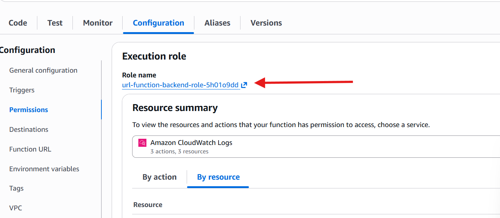
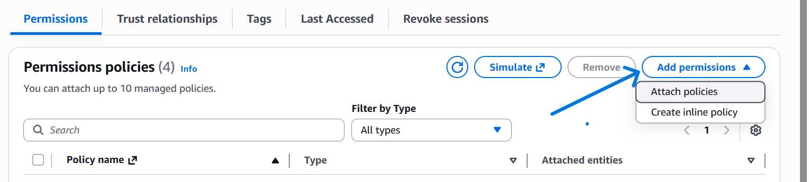

## URL SHORTENER ON AWS

**GOAL**:  To build a custom url shortener using some of the provided services on AWS. 

**OBJECTIVES**:

* **Deploy AWS Lambda Functions**: Configure and deploy the provided codebase on Python onto AWS Lambda to process the requests on-demand.

* **Traffic Routing**: Implement AWS API Gateway to route the incoming traffic directly to the pre-configured Lambda function.

* **Storage and Redirection**: Configure the AWS S3 for static web hosting for redirection and to store the shortcodes

* **Security Management**: Set up an IAM role that grants the necessary permissions for seamless and possible interactions. 


\
  **SERVICES TO BE USED**:

* Amazon S3
* Lambda
* API Gateway
* IAM 


## SETUP GUIDE
### 1. **Create and configure two(2) S3 buckets.**

 You will need two separate S# buckets for this exercise.

 #### **Bucket A:** URL Storage (We'll call this '*url-shortener-storage011*')  
 #### **Bucket B:** The Frontend Bucket (*url-shortener-frontend011*)
* Create a bucket with a globally unique ID and allow Public access.
* Click on the newly created bucket, head to 'Properties', scroll all the way down to 'enable static web hosting'. Turn on the function and input `index.html` & `error.html` in their respective fields.

### 2. Deploy Lambda Function

* Go to Lambda and create a function
* Choose a function name, eg; "url-shortener-function'
* Runtime: Python 3.14
* Architecture: x86_64
* Click 'Create function'

#### Configure Environment Variables of the Lambda function.
Still in the function page, do the following:

* Configuration tab → Environment variables → Edit
* Add two variables:

(i) BUCKET_NAME = url-shortener-storage011 (your first bucket name)

(ii)BASE_URL = http://url-shortener-storage011.s3-website-us-east-1.amazonaws.com (the URL from Step 1)

* Save
#### Add the code
* Replace the code with the contents of lambda_function.py in this repository
* Click 'Deploy' after adding the code

#### Add the necessary permissions
You need to give the default lambda execution role permissions to your S3 buckets
- On the url-function-backend on Lambda, click configuration, then click permissions
- On this page, you will see the lambda executor role, click on it and it will take you to IAM

- On the IAM page, click on add permissions, then select attach policies. 

- Search for the AmazonS3FullAccess permission and attach it to your Lambda role. 


### 3. Create API Gateway


1. Go to API Gateway → Create API
2. Click Build under "HTTP API" (not REST API)
3. Add integration:

####  Select Integration type: Lambda
Lambda function: Select url-shortener-backend
Version: 2.0 (latest)

Click 'Create'

\
**Create Routes**


#### Route 1: Create URL

* Method: POST
* Resource path: /shorten
* Integration target: Select your Lambda
* Create
#### Route 2: Get Stats
* Method: GET
* Resource path: /stats
* Integration target: Select your Lambda
* Create
#### Route 3: CORS Preflight 
* Method: OPTIONS
* Resource path: /{proxy+} (this catches all paths)
* Integration target: Select your Lambda
* Create

#### Configure CORS
Click Next until you see Configure CORS:
* Access-Control-Allow-Origin: *
* Access-Control-Allow-Methods: GET, POST, OPTIONS
* Access-Control-Allow-Headers: 'Content-Type'
* Click Next → Create
#### Get your API Endpoint
After creating, you'll see an Invoke URL at the top (looks like: https://abcdef123.execute-api.us-east-1.amazonaws.com). 

If you don't see it, look to the left side of your console and select 'stages' under 'deploy. Tou should be able to see it now.
*(Copy this URL and save it somewhere. You'd need it later)*

### 4. Deploy Frontend to S3

1. Go to S3 → Your frontend bucket (url-shortener-frontend011)
2. Upload → Add files → Select your index.html
3. Click Upload

Make it Public

1. Go to Permissions tab of the bucket
2. Bucket Policy → Edit
3. Paste this policy (replace your-bucket-name):
```
{
    "Version": "2012-10-17",
    "Statement": [
        {
            "Sid": "PublicReadGetObject",
            "Effect": "Allow",
            "Principal": "*",
            "Action": "s3:GetObject",
            "Resource": "arn:aws:s3:::url-shortener-frontend-12345/*"
        }
    ]
}
```
4. Save changes